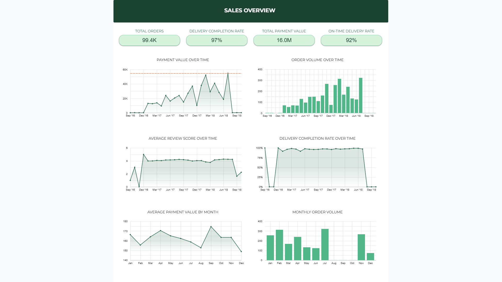
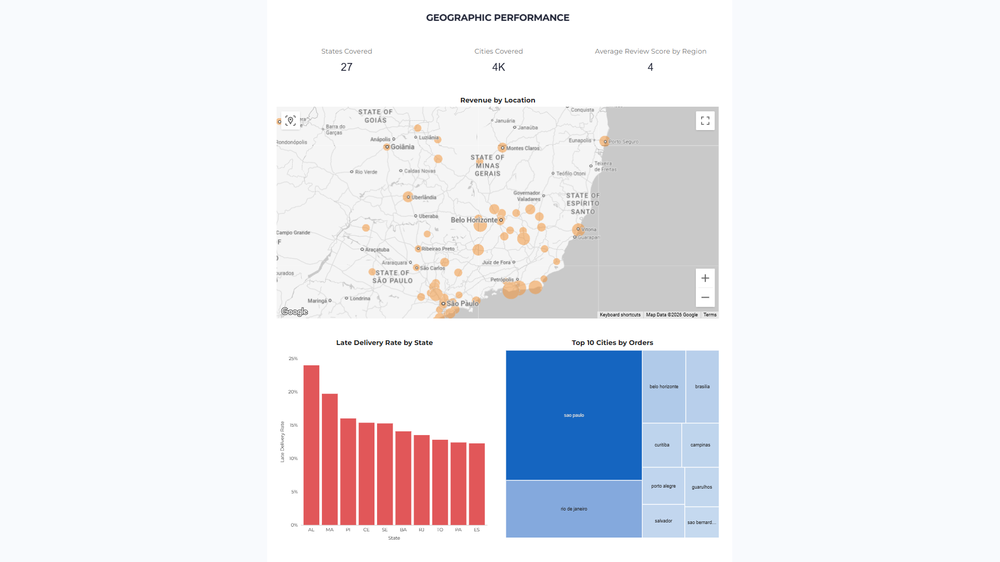

# 🛒 Olist Analytics Warehouse


> A production-style end-to-end ecommerce analytics warehouse built on the Brazilian **Olist** public dataset — from raw CSV ingestion through BigQuery, dbt transformations, and a 5-page Looker Studio dashboard.

<br/>

<div align="center">

<h3>🤝 Built By</h3>

<a href="https://github.com/Thir13een">
  
  <br/><sub><b>Krish</b></sub>
</a>
&nbsp;&nbsp;&nbsp;&nbsp;&nbsp;
<a href="https://github.com/shwetabankar54">
  
  <br/><sub><b>Shweta</b></sub>
</a>

<br/><br/>
<sub>⏱️ Built in 1 week</sub>

</div>

## 📊 Live Dashboard

**[View the Looker Studio Dashboard →](https://lookerstudio.google.com/reporting/6c0e6662-c340-4099-8f16-236ab5cee1fb)**

### Sales Overview


### Geographic Performance


---

## 📌 Project Overview

This project implements a full analytics engineering pipeline:

- **Ingest** raw Olist CSV data into BigQuery using a Python notebook
- **Transform** raw tables through a layered dbt warehouse (staging → intermediate → core → marts)
- **Test** data quality with 109 dbt tests including custom business-rule checks
- **Visualize** business insights across 5 Looker Studio dashboard pages

---

## 🏗️ Architecture

```
Raw CSV Files
      ↓
BigQuery Raw Tables (raw_*)
      ↓
Staging Layer (stg_*)        ← clean, cast, normalize
      ↓
Intermediate Layer (int_*)   ← reusable business logic
      ↓
Core Layer (fct_*, dim_*)    ← star schema facts & dimensions
      ↓
Business Marts (mart_*)      ← reporting-ready aggregates
      ↓
Looker Studio Dashboard      ← 5-page interactive dashboard
```

---

## 📊 Dashboard Pages

| Page | Source Mart | Key Content |
|---|---|---|
| 🏠 Sales Overview | `mart_sales_overview` | Revenue trend, order volume, review scores, delivery KPIs |
| 📦 Product Performance | `mart_product_performance` | Top categories, freight %, review scores, late delivery by category |
| 🗺️ Geographic Performance | `mart_geographic_performance` | Revenue map, late delivery by state, top cities |
| 👥 Customer Analytics | `mart_customer_overview` | LTV distribution, repeat rate, customers by state |
| 🏪 Seller Performance | `mart_seller_performance` + `mart_delivery_performance` | Top sellers, late delivery rate, delivery pipeline days |

---

## 🗂️ Project Layers

### 1. 📥 Raw Layer
Raw Olist tables loaded into BigQuery as `raw_*` tables via ingestion notebook:
- `INGEST/data-loading.ipynb`

### 2. 🧹 Staging Layer (`dev_staging`)
Standardizes raw source tables — cleans text, casts types, normalizes casing, converts blanks to NULL.

| Model | Description |
|---|---|
| `stg_customers` | Customer records |
| `stg_sellers` | Seller records |
| `stg_orders` | Order headers |
| `stg_order_items` | Order line items |
| `stg_products` | Product catalog |
| `stg_payments` | Payment records |
| `stg_reviews` | Customer reviews |
| `stg_geolocation` | Zip code coordinates |
| `stg_product_category_translation` | PT → EN category names |

### 3. ⚙️ Intermediate Layer (`dev_intermediate`)
Reusable business logic combining multiple staging models.

| Model | Description |
|---|---|
| `int_orders` | One row per order — aggregates items, payments, reviews |

### 4. ⭐ Core Layer (`dev_marts`)
Star-schema facts and dimensions for flexible analytics.

| Model | Grain | Purpose |
|---|---|---|
| `fct_orders` | 1 row per order | Main order fact table |
| `fct_order_items` | 1 row per order item | Item-level sales fact |
| `dim_customers` | 1 row per customer | Customer attributes + order history |
| `dim_products` | 1 row per product | Product attributes + translated category |
| `dim_sellers` | 1 row per seller | Seller geography |
| `dim_dates` | 1 row per date | Calendar dimension |
| `dim_geolocation` | 1 row per zip prefix | Lat/lng + city/state lookup |

### 5. 📈 Business Marts (`dev_marts`)
Reporting-ready aggregates for each dashboard page.

| Model | Grain | Purpose |
|---|---|---|
| `mart_sales_overview` | Daily | Revenue, orders, delivery, reviews |
| `mart_product_performance` | Per product | Sales, freight, reviews, late delivery |
| `mart_geographic_performance` | Per zip prefix | Revenue, customers, delivery by location |
| `mart_customer_overview` | Per customer | LTV, repeat status, order history |
| `mart_seller_performance` | Per seller | Revenue, delivery, review performance |
| `mart_delivery_performance` | Daily × status | Lead time breakdown by stage |

---

## ✅ Data Quality

**109 dbt tests** covering all layers:

| Test Type | Coverage |
|---|---|
| `not_null` | All primary and foreign keys |
| `unique` | All grain columns |
| `accepted_values` | Order status, payment types |
| `relationships` | FK integrity across all fact/dim joins |
| `dbt_utils.unique_combination_of_columns` | Composite keys |

**Custom singular tests:**
- `delivered_orders_have_delivered_at.sql`
- `delivered_orders_have_shipped_at.sql`
- `stg_payments_payment_value_non_negative.sql`
- `stg_order_items_price_non_negative.sql`
- `stg_order_items_freight_value_non_negative.sql`

> ⚠️ 2 intentional failing tests — delivered orders missing timestamps are known source-data anomalies kept visible on purpose.

---

## 🔑 Key Insights from the Data

### 📈 Sales & Growth
- **99.4K orders** totalling **R$16M** in payment value — average of ~R$161 per order
- Strong growth trajectory from late 2016 through mid-2018 driven by both **more orders and higher spend**
- **Peak revenue and volume in Jun–Jul 2018** — highest performing months in the dataset
- Seasonal patterns: **Jan–Feb and Jul are peak months**, Aug–Sep consistently slowest
- Average payment value peaks in **Feb–Mar (~R$170)** — likely Valentine's Day effect
- Note: Sep 2018 data cliff is a **dataset cutoff**, not a business drop — orders placed late 2018 were still in transit when the snapshot was taken

### 🚚 Delivery Performance
- **97% delivery completion rate** — only 3% of orders failed to deliver
- **92% on-time delivery rate** — 1 in 12 delivered orders arrived late
- Average delivery pipeline: **0.4 days approval → 3.4 days to ship → 12.6 days to deliver**
- Biggest time sink is the **last-mile delivery at 12.6 days** — Brazil's vast geography is the key constraint
- **Northeast states severely underperform**: AL (Alagoas) at ~25% late rate, MA (Maranhão) at ~20%
- Southeast and South states deliver on time — the problem is concentrated in states far from São Paulo distribution centers

### 🗺️ Geographic Distribution
- Olist reached **all 27 Brazilian states** and **4,000+ cities** — true nationwide coverage
- **São Paulo dominates** revenue and order volume — bubble cluster on the map is ~3x denser than any other region
- **Top 10 cities by orders** are exclusively from Southeast and South Brazil — São Paulo, Rio de Janeiro, Belo Horizonte, Brasília, Curitiba, Campinas, Porto Alegre, Guarulhos, Salvador, São Bernardo
- **Northeast Brazil is an underserved market** — low order volume combined with high late delivery rates suggests both a demand opportunity and a logistics problem to solve

### 👥 Customer Behaviour
- Only **6.4% repeat customer rate** — 94% of customers bought once and never returned
- Average customer lifetime value of **R$161** — close to single-order value, confirming the low repeat rate
- Massive retention opportunity: improving repeat purchase rate even to 15% would nearly double LTV

### ⭐ Quality
- Review scores stabilise at **~4.1 / 5** after early 2017 — consistent quality maintained through growth
- Early 2016 scores are volatile due to very low order volumes — not representative

---

## 🚀 Useful Commands

### Build everything
```powershell
dbt build --project-dir DBT-WAREHOUSE --profiles-dir DBT-WAREHOUSE
```

### Build a single model
```powershell
dbt build --project-dir DBT-WAREHOUSE --profiles-dir DBT-WAREHOUSE --select mart_sales_overview
```

### Run tests only
```powershell
dbt test --project-dir DBT-WAREHOUSE --profiles-dir DBT-WAREHOUSE
```

---

## ⚙️ Environment Setup

1. Copy `.env.example` to `.env` and fill in your values:

```env
GOOGLE_APPLICATION_CREDENTIALS=C:\path\to\your\gcp-service-account.json
DBT_BIGQUERY_PROJECT=your-gcp-project-id
DBT_BIGQUERY_DATASET=dev
DBT_BIGQUERY_LOCATION=US
DBT_BIGQUERY_THREADS=4
```

2. Keep the GCP service account JSON **outside the repository**
3. `.env` is gitignored and should never be committed

---

## 📁 Repository Layout

```
olist-analytics-warehouse/
├── DBT-WAREHOUSE/
│   ├── models/
│   │   ├── staging/
│   │   ├── intermediate/
│   │   └── marts/
│   │       ├── core/
│   │       ├── sales/
│   │       ├── customers/
│   │       └── operations/
│   ├── macros/
│   ├── tests/
│   ├── dbt_project.yml
│   └── profiles.yml
├── INGEST/
│   └── data-loading.ipynb
├── EXPORTS/
│   ├── raw/
│   ├── dev_staging/
│   ├── dev_intermediate/
│   └── dev_marts/
├── .env.example
├── .gitignore
└── README.md
```

---

## 🔒 Security

- GCP service account JSON is stored **outside the repository**
- `.env` is gitignored
- `.gitignore` covers `.env`, `*.json`, and common credential patterns
- Only `.env.example` is committed as a safe template

---

## 🛠️ Tech Stack

| Tool | Purpose |
|---|---|
| Python + Jupyter | Raw data ingestion |
| Google BigQuery | Cloud data warehouse |
| dbt | Data transformation + testing |
| dbt-utils | Extended test coverage |
| Looker Studio | Dashboard + visualization |
